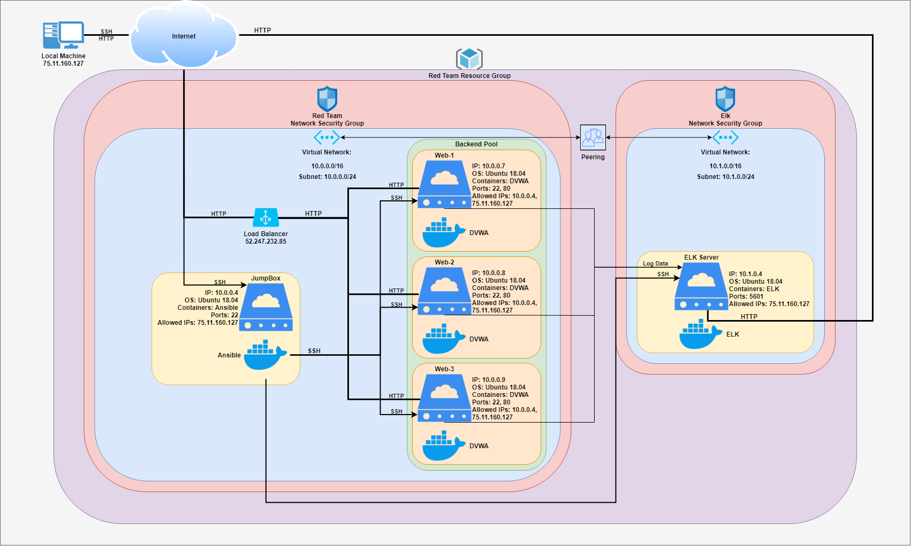
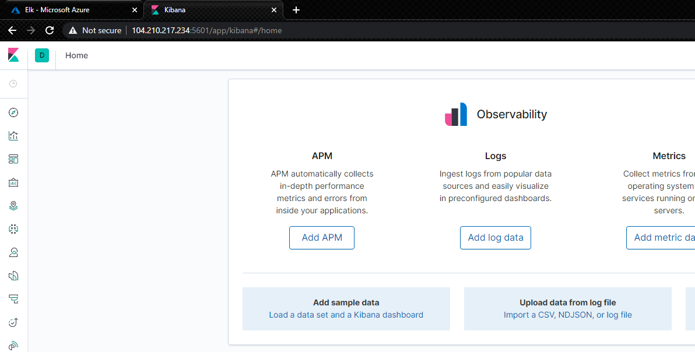

## Automated ELK Stack Deployment

The files in this repository were used to configure the network depicted below.

These files have been tested and used to generate a live ELK deployment on Azure. They can be used to either recreate the entire deployment pictured above. Alternatively, select playbook files may be used to install only certain pieces of it, such as Filebeat.

[install-elk.yml](Ansible/install-elk.yml)

[filebeat-playbook.yml](Ansible/filebeat-playbook.yml)

[metricbeat-playbook.yml](Ansbile/metricbeat-playbook.yml)
	  
This document contains the following details:
- Description of the Topology
- Access Policies
- ELK Configuration
  - Beats in Use
  - Machines Being Monitored
- How to Use the Ansible Build

### Description of the Topology

The main purpose of this network is to expose a load-balanced and monitored instance of DVWA, the D*mn Vulnerable Web Application.

Load balancing ensures that the application will be highly redundant, in addition to restricting access to the network.
	Load balancers protect the availability of a network. A jump box helps restrict the remote access to servers.

Integrating an ELK server allows users to easily monitor the vulnerable VMs for changes to the file system and system metrics.

The configuration details of each machine may be found below.

| Name     | Function  | IP Address | Operating System |
|----------|-----------|------------|------------------|
| Jump Box | Gateway   | 10.0.0.1   | Linux            |
| Web-1    | WebServer | 10.0.0.7   | Linux            |
| Web-2    | WebServer | 10.0.0.8   | Linux            |
| Web-3    | WebServer | 10.0.0.9   | Linux            |
| Elk      | SysMonitor| 10.1.0.4   | Linux            |

### Access Policies

The machines on the internal network are not exposed to the public Internet. 

Only the Jump Box machine can accept connections from the Internet. Access to this machine is only allowed from the following IP addresses:
		Local Machine IPv4

Machines within the network can only be accessed by the Ansible container on the JumpBox. They have a public key generated in the Ansible docker container as their access key.
		Ansible, 10.0.0.4. My local machine was also given access to the Elk machine's port 5601 to view Kibana.
A summary of the access policies in place can be found in the table below.

| Name     | Publicly Accessible | Allowed IP Addresses |
|----------|---------------------|----------------------|
| Jump Box | Yes                 | Local Machine IPv4
| Web-1    | No                  | 10.0.0.4             |
| Web-2    | No                  | 10.0.0.4             |
| Web-3    | No                  | 10.0.0.4             |
| Elk      | No                  | 10.0.0.4             |

### Elk Configuration

Ansible was used to automate configuration of the ELK machine. No configuration was performed manually, which is advantageous because this allows redundant installation across multiple servers that can be back ups of each other. We can be certain all of the servers have the same installation and we don't have to connect to each one separately to do so.
		
The playbook implements the following tasks:
	Install docker
	Install python3
	Install Docker pip
	Download Docker image
	Enable Docker

The following screenshot displays the result of running `docker ps` after successfully configuring the ELK instance.

### Target Machines & Beats
This ELK server is configured to monitor the following machines:
	10.0.0.7
	10.0.0.8
	10.0.0.9
We have installed the following Beats on these machines:
	Filebeat
	Metricbeat
These Beats allow us to collect the following information from each machine:
	Filebeat collects the log files of the servers it is monitoring. We would expect to see things like Metricbeat logging its upload of monitoring to Kibana. Metricbeat is collecting system metric data, that is things like CPU resource usage and uptime. Specifically it is viewing the metrics of the docker containers on the servers.
	
### Using the Playbook
In order to use the playbook, you will need to have an Ansible control node already configured. Assuming you have such a control node provisioned: 

SSH into the control node and follow the steps below:

- Copy the desired playbook file to /etc/ansible/roles/.
- If installing filebeat or metricbeat: 
- `mkdir /etc/ansible/files/`
- `curl https://gist.githubusercontent.com/slape/5cc350109583af6cbe577bbcc0710c93/raw/eca603b72586fbe148c11f9c87bf96a63cb25760/Filebeat > /etc/ansible/files/filebeat-config.yml` 
- `curl https://gist.githubusercontent.com/slape/58541585cc1886d2e26cd8be557ce04c/raw/0ce2c7e744c54513616966affb5e9d96f5e12f73/metricbeat > /etc/ansible/files/metricbeat-config.yml`
- Update the config files to include the private IP of the Elk server as the Elastic Search and Kibana host IP.
- Update the hosts file `nano /etc/ansible/hosts` to include the IPs of the machines you wish to install to. Specify them under elk and webservers respectively.
- 
- Run the playbook `ansible-playbook <name of playbook>` , and navigate to ElkMachinePublicIP:5601 in the web browser to check that the installation worked as expected. If installing a beat, use the Kibana set up guide and click Check Data at the bottom to verify successful install.

Kibana accessible via the Elk server public IP.

Filebeat working under Add Log Data > System Logs> Deb > Check Data

Viewing the Dashboard

Metricbeat working under Add Metric Data > Docker Metrics > Check Data

Metricbeat Dashboard

Running stress command from a playbook on all servers to check CPU Usage
[stress.yml](Ansible/stress.yml)

